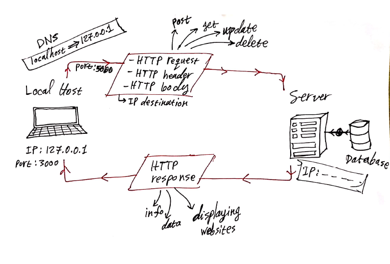
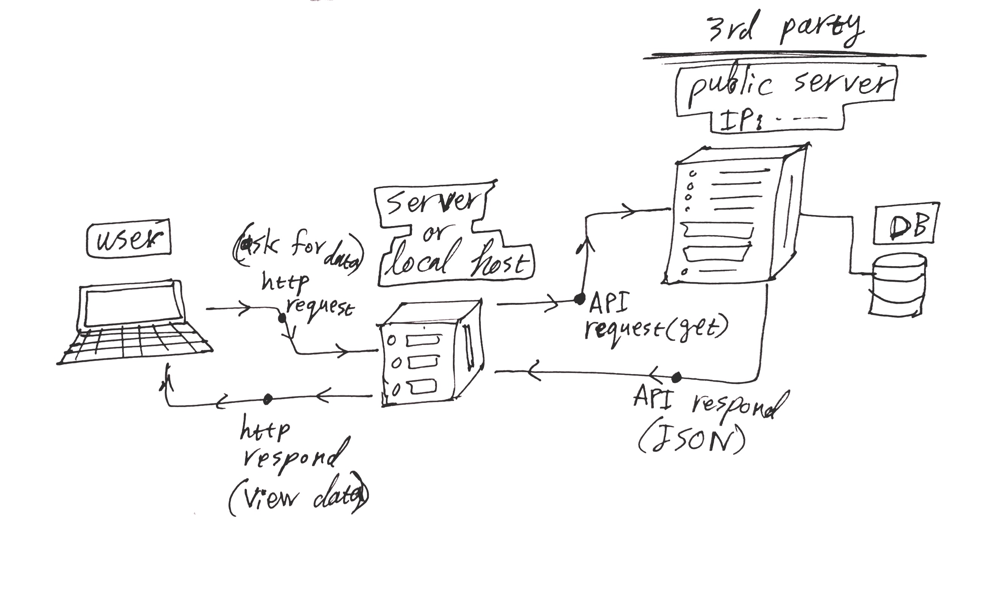

# Movies-Library - Version 1

**Author Name**: Mustfa Alhasanat 

## WRRC

---
## Overview
---
## Getting Started
<!-- What are the steps that a user must take in order to build this app on their own machine and get it running? -->
- download the repository
- change the directory to "Movies-Library"
- install npm by CMD:  
>npm init -y
- install the packages: 
>npm install express cors 
- run the project to start the server: 
>npm start

---
## Project Features
Go to any browser and type one of these URLs:
- to get the main page 
>localhost:30000 

- to get the favorite page:
>localhost:30000/favorite
